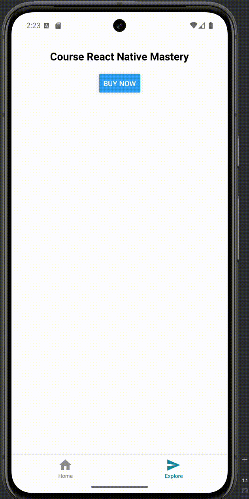

# @codearcade/expo-razorpay

A modern, maintained Razorpay SDK for **Expo** and **React Native**.

Built as a community replacement for the outdated official Razorpay React Native SDK.

<p align="center">
  
</p>

<p align="center">
  <em>Quick demo of the Razorpay Expo SDK in action</em>
</p>

---

## ✨ Features

- 🎯 **Hook-based API** - Use `useRazorpay()` directly in any component
- 🌐 Works with Expo (WebView-based)
- 📦 No outdated native dependencies
- ⚡ Lightweight and fast
- 🎨 Simple to integrate - returns JSX that you render
- 🔄 Designed for real production usage

---

## Installation

```bash
npm install @codearcade/expo-razorpay
```

## Quick Start

The `useRazorpay` hook returns a JSX component (`RazorpayUI`) that you must render in your component. This gives you complete control over when and where the checkout appears.

### Basic Example

```tsx
import React from 'react';
import { View, Button } from 'react-native';
import { useRazorpay } from '@codearcade/expo-razorpay';

export default function PaymentScreen() {
  const { openCheckout, RazorpayUI } = useRazorpay();

  const handleBuy = () => {
    openCheckout(
      {
        key: 'YOUR_RAZORPAY_KEY',
        amount: 100, // Amount in paise (100 paise = 1 INR)
        currency: 'INR',
        order_id: 'order_RPNBJhnTs2Lq0B',
        name: 'Test Company',
        description: 'Test Transaction',
        prefill: {
          name: 'John Doe',
          email: 'test@example.com',
          contact: '1234567890',
        },
        theme: {
          color: '#ffd35c',
        },
      },
      {
        onSuccess: (data) => {
          console.log('Payment Success:', data);
          // Handle successful payment
        },
        onFailure: (error) => {
          console.log('Payment Failed:', error);
          // Handle payment failure
        },
        onClose: () => {
          console.log('Checkout closed');
        },
      }
    );
  };

  return (
    <View>
      <Button title="Buy Now" onPress={handleBuy} />

      {/* Render the checkout UI */}
      {RazorpayUI}
    </View>
  );
}
```

### Advanced Example with Navigation

```tsx
import React from 'react';
import { View, Button } from 'react-native';
import { useRazorpay } from '@codearcade/expo-razorpay';
import { useRouter } from 'expo-router';

export default function PaymentScreen() {
  const { openCheckout, closeCheckout, RazorpayUI } = useRazorpay();
  const router = useRouter();

  const handleBuy = async () => {
    // 1. Create order on your backend
    // const orderResponse = await fetch("/api/create-order", { method: "POST" });
    // const { orderId, amount } = await orderResponse.json();

    // For demo:
    const orderId = 'order_RPNBJhnTs2Lq0B';
    const amount = 100;

    openCheckout(
      {
        key: 'YOUR_RAZORPAY_KEY',
        amount: amount,
        currency: 'INR',
        order_id: orderId,
        name: 'Your Store',
        description: 'Purchase Description',
        image: 'https://your-logo-url.com/logo.png',
        prefill: {
          name: 'John Doe',
          email: 'john@example.com',
          contact: '9876543210',
        },
        notes: {
          order_id: orderId,
        },
        theme: {
          color: '#3399cc',
        },
      },
      {
        onSuccess: (data) => {
          console.log('Payment Success:', data);
          closeCheckout();

          // Navigate to success screen
          router.replace({
            pathname: '/success',
            params: {
              paymentId: data.razorpay_payment_id,
              amount: amount.toString(),
              date: new Date().toISOString(),
            },
          });
        },
        onFailure: (error) => {
          console.log('Payment Failed:', error);
          // Optionally close and navigate to failure screen
        },
        onClose: () => {
          console.log('Customer closed the checkout');
        },
      }
    );
  };

  return (
    <View style={{ flex: 1, justifyContent: 'center', alignItems: 'center' }}>
      <Button title="Proceed to Checkout" onPress={handleBuy} />

      {/* The checkout UI is rendered here when active */}
      {RazorpayUI}
    </View>
  );
}
```

## API Reference

### `useRazorpay()` Hook

The main hook to manage Razorpay checkout. Returns an object with the following properties:

#### Returns

```typescript
{
  openCheckout: (options: RazorpayOptions, callbacks: RazorpayCallbacks) => void;
  closeCheckout: () => void;
  RazorpayUI: JSX.Element | null;
  isVisible: boolean;
}
```

#### Properties

| Property        | Type                                                               | Description                                                                                        |
| --------------- | ------------------------------------------------------------------ | -------------------------------------------------------------------------------------------------- |
| `openCheckout`  | `(options: RazorpayOptions, callbacks: RazorpayCallbacks) => void` | Opens the checkout modal with the given options and callbacks                                      |
| `closeCheckout` | `() => void`                                                       | Closes the checkout modal programmatically                                                         |
| `RazorpayUI`    | `JSX.Element \| null`                                              | **Required**: The JSX component that renders the checkout. Must be rendered in your component tree |
| `isVisible`     | `boolean`                                                          | Whether the checkout is currently visible                                                          |

### `RazorpayOptions` Object

Configuration object passed to `openCheckout()`.

| Field             | Type     | Required  | Description                                                                                     |
| ----------------- | -------- | --------- | ----------------------------------------------------------------------------------------------- |
| `key`             | `string` | **Yes**   | Your Razorpay Key ID (from dashboard settings)                                                  |
| `amount`          | `number` | **Yes**   | Amount in lowest currency unit (paise for INR, e.g., 100 = 1 INR)                               |
| `currency`        | `string` | **Yes**   | Currency code (e.g., "INR")                                                                     |
| `order_id`        | `string` | **Yes\*** | Order ID from your backend. (\*Either `order_id` or `subscription_id` is mandatory)             |
| `subscription_id` | `string` | **Yes\*** | Subscription ID for recurring payments. (\*Either `order_id` or `subscription_id` is mandatory) |
| `name`            | `string` | No        | Your company/app name, displayed in checkout                                                    |
| `description`     | `string` | No        | Transaction description                                                                         |
| `image`           | `string` | No        | Your logo URL (recommended: 120x120px)                                                          |
| `prefill`         | `object` | No        | Pre-fill customer details: `{ name, email, contact }`                                           |
| `notes`           | `object` | No        | Custom notes object (key-value pairs)                                                           |
| `theme`           | `object` | No        | Theme customization: `{ color: "#hexcolor" }`                                                   |

### `RazorpayCallbacks` Object

Callbacks passed as the second argument to `openCheckout()`.

```typescript
interface RazorpayCallbacks {
  onSuccess: (data: RazorpaySuccessResponse) => void;
  onFailure: (error: RazorpayErrorResponse['error']) => void;
  onClose?: () => void;
}
```

#### Callback Fields

| Field       | Type                                      | Description                                 |
| ----------- | ----------------------------------------- | ------------------------------------------- |
| `onSuccess` | `(data: RazorpaySuccessResponse) => void` | Called when payment succeeds                |
| `onFailure` | `(error: RazorpayError) => void`          | Called when payment fails                   |
| `onClose`   | `() => void`                              | Called when user closes checkout (optional) |

#### Success Response Data

```typescript
{
  razorpay_payment_id: string;
  razorpay_order_id: string;
  razorpay_signature: string;
  // Additional payment details...
}
```

---

## Best Practices

1. **Always Render RazorpayUI**: Make sure to include `{RazorpayUI}` in your component's JSX. Without this, the checkout modal won't appear.

   ```tsx
   return (
     <View>
       <Button title="Pay Now" onPress={handleBuy} />
       {RazorpayUI} {/* ✅ Required */}
     </View>
   );
   ```

2. **Create Orders on Backend**: Always generate `order_id` on your backend for security.

   ```tsx
   const createOrder = async () => {
     const response = await fetch('https://your-api.com/orders', {
       method: 'POST',
       headers: { 'Content-Type': 'application/json' },
       body: JSON.stringify({ amount: 100, currency: 'INR' }),
     });
     return await response.json();
   };
   ```

3. **Handle Errors Gracefully**: Always implement `onFailure` for user feedback.

   ```tsx
   onFailure: (error) => {
     Alert.alert('Payment Failed', error.description);
   };
   ```

4. **Verify Payments**: Always verify the signature on your backend:

   ```tsx
   onSuccess: async (data) => {
     const verified = await fetch('https://your-api.com/verify-payment', {
       method: 'POST',
       body: JSON.stringify(data),
     });
   };
   ```

---

## Troubleshooting

### Checkout Not Appearing

- ✅ Make sure you're rendering `RazorpayUI` in your JSX
- ✅ Verify that `openCheckout()` is being called with valid options
- ✅ Check browser console for errors

### Payment Not Going Through

- ✅ Ensure `key`, `amount`, and `order_id` are correctly set
- ✅ Verify order was created on your backend
- ✅ Check Razorpay dashboard for API key validity

---

⚠️ **Disclaimer**  
This is an independent, community-maintained project and is not affiliated with or endorsed by Razorpay or Expo.

## License

MIT
